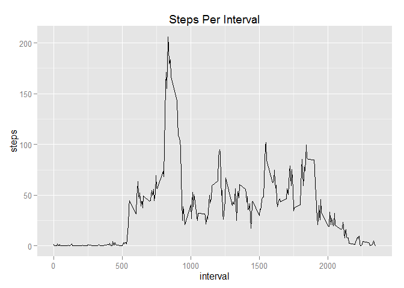
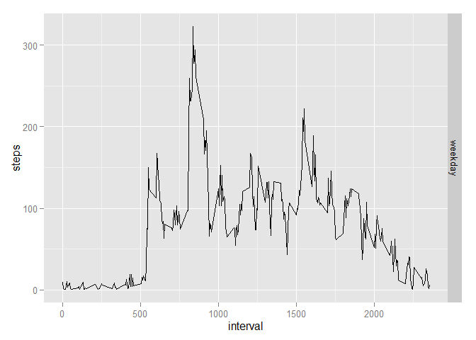

# Reproducible Research: Peer Assessment 1


## Loading and preprocessing the data

1.Load the data (i.e. read.csv())

2.Process/transform the data (if necessary) into a format suitable for your analysis


```r
data_act<-read.csv(unz("activity.zip", "activity.csv")) ## read data
data_act$date<-as.Date(data_act$date) ## convert the date format
```

## What is mean total number of steps taken per day?

1.Make a histogram of the total number of steps taken each day


```r
library(reshape2)
library(ggplot2)
melt_data<-melt(data_act,id=c("date"),measure.vars=("steps"),na.rm=TRUE)
sum_act<-dcast(melt_data,date~variable,sum)
qplot(steps,data=sum_act)
```

```
## stat_bin: binwidth defaulted to range/30. Use 'binwidth = x' to adjust this.
```

 

2.Calculate and report the mean and median total number of steps taken per day


```r
mean1<-mean(melt_data$value)
median1<-median(melt_data$value)
summary<-data.frame(mean1,median1)
print(summary)
```

```
##     mean1 median1
## 1 37.3826       0
```

## What is the average daily activity pattern?

1.Make a time series plot (i.e. type = "l") of the 5-minute interval (x-axis) and the average number of steps taken, averaged across all days (y-axis)


```r
library(ggplot2)
melt_time<-melt(data_act,id=c("interval"),measure.vars=("steps"),na.rm=TRUE)
average_time<-dcast(melt_time,interval~variable,mean)
g<-qplot(interval,steps,data=average_time,geom="line")
g+labs(title="Steps Per Interval")
```

 

2.Which 5-minute interval, on average across all the days in the dataset, contains the maximum number of steps?


```r
max_time<-max(average_time$steps)
average_time[average_time$steps==max_time,]
```

```
##     interval    steps
## 104      835 206.1698
```
## Imputing missing values

1.Calculate and report the total number of missing values in the dataset (i.e. the total number of rows with NAs)


```r
data_act1<-read.csv(unz("activity.zip", "activity.csv"))
data_act1$date<-as.Date(data_act1$date)
length(which(is.na(data_act1$steps)==TRUE))
```

```
## [1] 2304
```

2.Devise a strategy for filling in all of the missing values in the dataset.

**My strategy was filling the NA's with the general average per interval... For example, I use the general mean for 5-minute interval for all the NA's that belongs in that interval...**


```r
datamerge<-merge(data_act1,average_time,by.x="interval",by.y="interval")
datamerge$steps_f<-ifelse(is.na(datamerge$steps.x),datamerge$steps.y,datamerge$steps.x)
```

3.Create a new dataset that is equal to the original dataset but with the missing data filled in.


```r
data_act_new = data.frame(datamerge$interval, datamerge$date, datamerge$steps_f)  
colnames(data_act_new)<-c("interval","date","steps")
data_act_new$steps<-ifelse(data_act_new$steps==0,NA,data_act_new$steps)
data_act_new<-data_act_new[order(data_act_new$date, data_act_new$interval),]
```

4.Make a histogram of the total number of steps taken each day and Calculate and report the mean and median total number of steps taken per day. Do these values differ from the estimates from the first part of the assignment? What is the impact of imputing missing data on the estimates of the total daily number of steps?


```r
library(ggplot2)
melt_data_new<-melt(data_act_new,id=c("date"),measure.vars=("steps"),na.rm=TRUE)
sum_act_new<-dcast(melt_data_new,date~variable,sum)
qplot(steps,data=sum_act_new)
```

```
## stat_bin: binwidth defaulted to range/30. Use 'binwidth = x' to adjust this.
```

 
### THE VALUES ARE THE SAME, BECAUSE A TAKE 0 LIKE A REAL LECTURE


```r
mean2<-mean(melt_data_new$value)
median2<-median(melt_data_new$value)
summary_new<-data.frame(mean2,median2)
print(summary_new)
```

```
##      mean2  median2
## 1 102.5832 45.33962
```
## Are there differences in activity patterns between weekdays and weekends?

1.Create a new factor variable in the dataset with two levels -- "weekday" and "weekend" indicating whether a given date is a weekday or weekend day.


```r
data_act_new$weekdays<-weekdays(data_act_new$date)
data_act_new$type_day<-ifelse((data_act_new$weekdays=="sabado"|data_act_new$weekdays=="saturday"|data_act_new$weekdays=="domingo"|data_act_new$weekdays=="sunday"),"weekend","weekday")
```

2.Make a panel plot containing a time series plot (i.e. type = "l") of the 5-minute interval (x-axis) and the average number of steps taken, averaged across all weekday days or weekend days (y-axis). 


```r
library(ggplot2)
melt_time_new1<-melt(data_act_new,id=c("interval","type_day"),measure.vars=("steps"),na.rm=TRUE)
average_time_new<-dcast(melt_time_new1,interval+type_day~variable,mean)
qplot(interval,steps,data=average_time_new,facets=type_day~.,geom="line")
```

 
